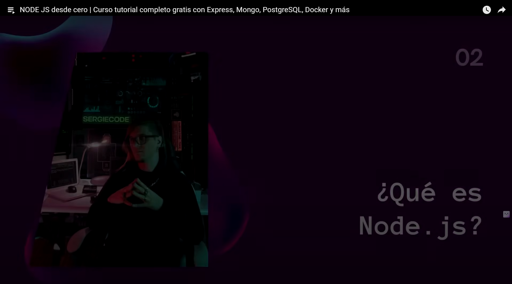
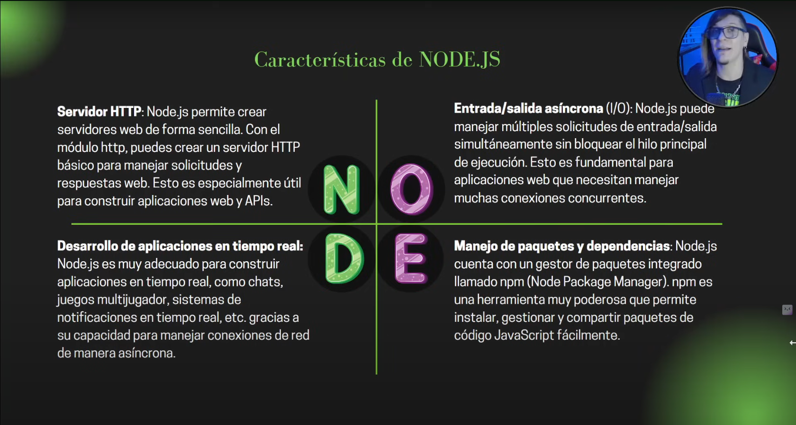

# [00:20:23](https://www.youtube.com/watch?v=I17ln313Pjk&t=1223s) - ¿Qué es NodeJS?

# 🧩 ¿Qué es una API RESTful?

Una **API RESTful** es una forma de **comunicación entre programas** (por ejemplo, un navegador y un servidor) usando  **reglas simples basadas en la web** .

* API = "Interfaz de Programación de Aplicaciones"
* REST = "Transferencia de Estado Representacional" (en inglés:  **Representational State Transfer** )

---

## 📦 Desglosando los acrónimos:

### 📌 **API** (Application Programming Interface)

**Interfaz de Programación de Aplicaciones**

> Es como un **menú de funciones** que una aplicación ofrece para que otra pueda usarla sin saber cómo está hecha por dentro.

📖 Ejemplo real:

Tú usas una app del clima que **llama a la API** de un servidor para pedir el clima de hoy.

---

### 📌 **REST** (Representational State Transfer)

**Transferencia de Estado Representacional**

> Es un conjunto de reglas para diseñar  **APIs que funcionan sobre HTTP** , el mismo protocolo que usa tu navegador.

REST dice que puedes usar **operaciones estándar** como:

| Verbo HTTP | Acción típica  | Ejemplo en RESTful API                      |
| ---------- | ---------------- | ------------------------------------------- |
| `GET`    | Obtener datos    | `GET /usuarios`→ lista de usuarios       |
| `POST`   | Crear algo nuevo | `POST /usuarios`→ crear un nuevo usuario |
| `PUT`    | Actualizar algo  | `PUT /usuarios/1`→ editar usuario 1      |
| `DELETE` | Eliminar algo    | `DELETE /usuarios/1`→ eliminar usuario 1 |

---

## 🧠 En resumen:

| Término              | Significado simple                                       |
| --------------------- | -------------------------------------------------------- |
| **API**         | Una forma de que un programa use funciones de otro       |
| **REST**        | Un estilo de diseño para que esa comunicación use HTTP |
| **RESTful API** | Una API que**sigue las reglas de REST**            |

---

## 🎯 Ejemplo visual sencillo:

Imagina que tu app de recetas quiere mostrar recetas desde un servidor:

* Tu app hace `GET /recetas` → y el servidor responde con una lista de recetas en  **JSON** .
* Si quieres agregar una receta nueva, haces `POST /recetas`.

## 🗣️ Conversación simulada: cómo funciona una API RESTful

###### Revisar el ejemplo en el archivo respuesta.js dentro de la carpeta 02
