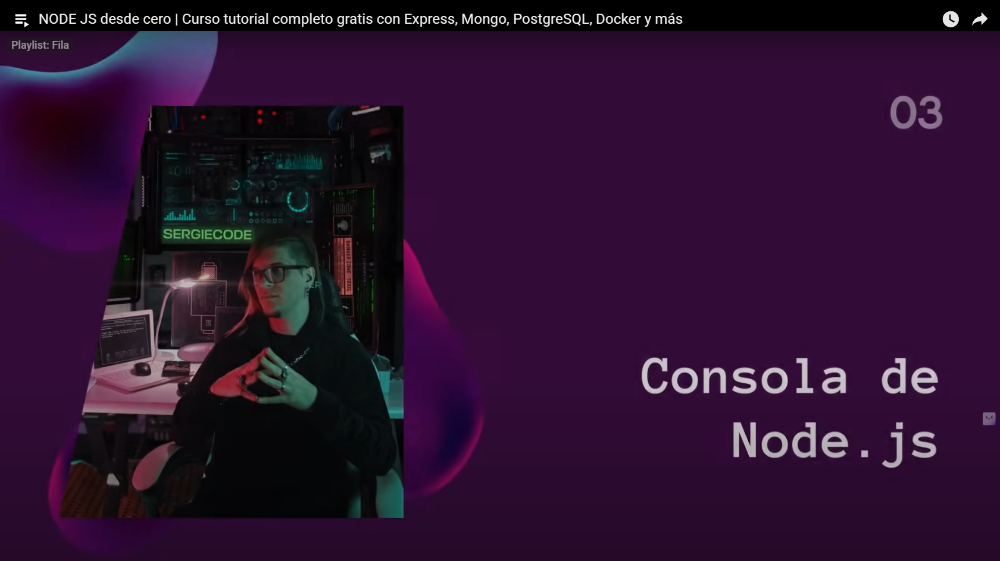
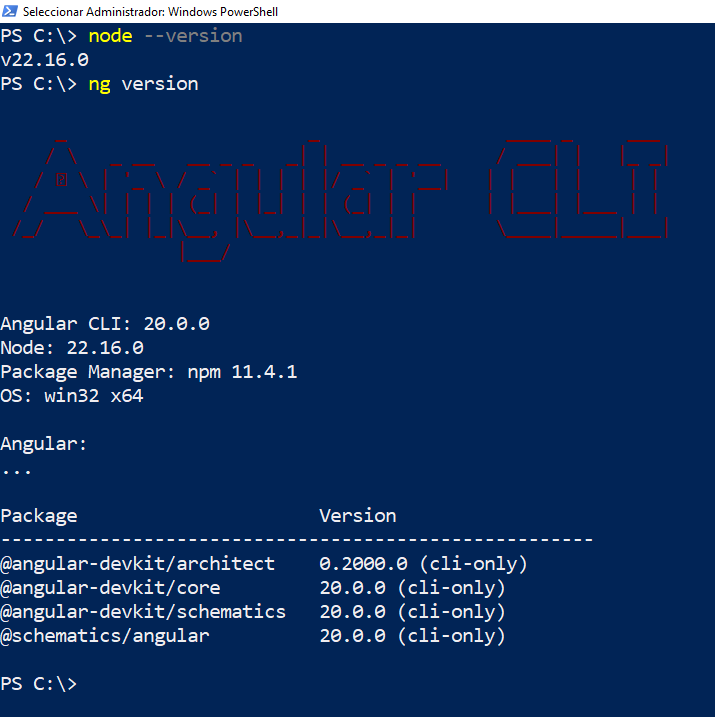

# [00:26:51](https://www.youtube.com/watch?v=I17ln313Pjk&t=1611s)- Consola de NodeJS

## Se refiere a la pestaña CONSOLA del navegador Chrome, al darle click derecho en la página que muestra el navegador, por ejemplo: index.html

## Comandos para verficar las versiones de NodeJS

Para el caso de macOS: abrir la Terminal y ejecutar los mismos comandos; que NO pertenecen al OS Windows ni a macOS.
