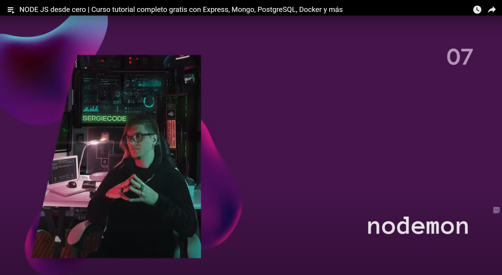
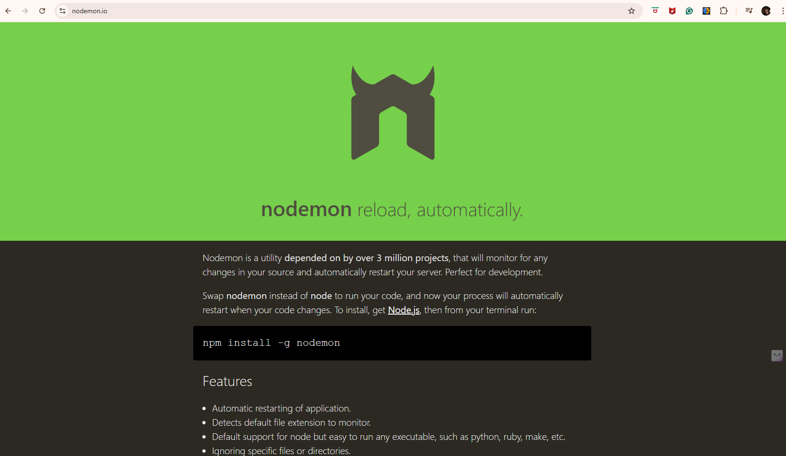

# [00:55:07](https://www.youtube.com/watch?v=I17ln313Pjk&t=3307s) - Nodemon

## Lo vamos instalar de manera local o en la instancia o carpeta de nuestro proyecto, con el siguiente comando: *npm install --save-dev nodemon*
