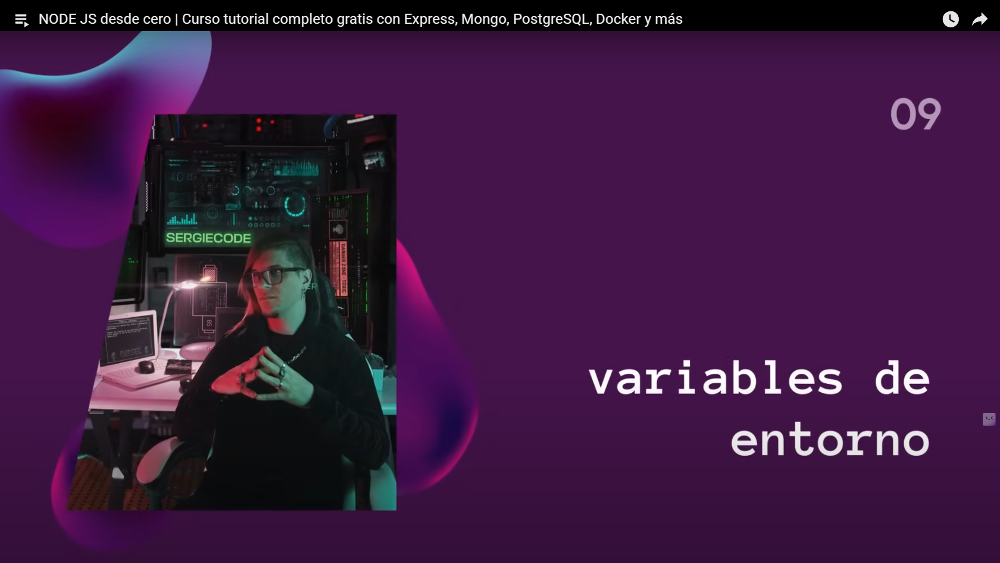

# [01:09:13](https://www.youtube.com/watch?v=I17ln313Pjk&list=TLPQMDEwNjIwMjUxxiOoJ0A2bA&index=1&t=4153s) - Variables de Entorno

# Usaremos la siguiente página: *[https://www.npmjs.com/package/dotenv]()*
