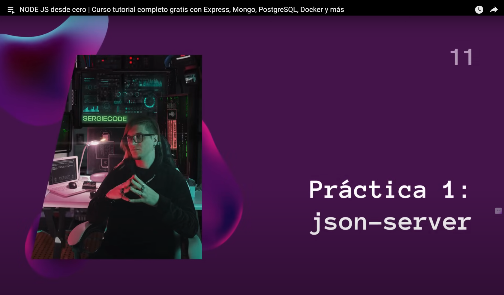

# [01:28:05](https://www.youtube.com/watch?v=I17ln313Pjk&list=TLPQMDEwNjIwMjUxxiOoJ0A2bA&index=1&t=5285s) - **Práctica 1 - JSON Server**

# [01:36:57](https://www.youtube.com/watch?v=I17ln313Pjk&list=TLPQMDEwNjIwMjUxxiOoJ0A2bA&index=1&t=5817s) - Postman

# [01:46:30](https://www.youtube.com/watch?v=I17ln313Pjk&list=TLPQMDEwNjIwMjUxxiOoJ0A2bA&index=1&t=6390s) - Subir Repositorio a Github

# [01:51:07](https://www.youtube.com/watch?v=I17ln313Pjk&list=TLPQMDEwNjIwMjUxxiOoJ0A2bA&index=1&t=6667s) - Códigos HTTP
