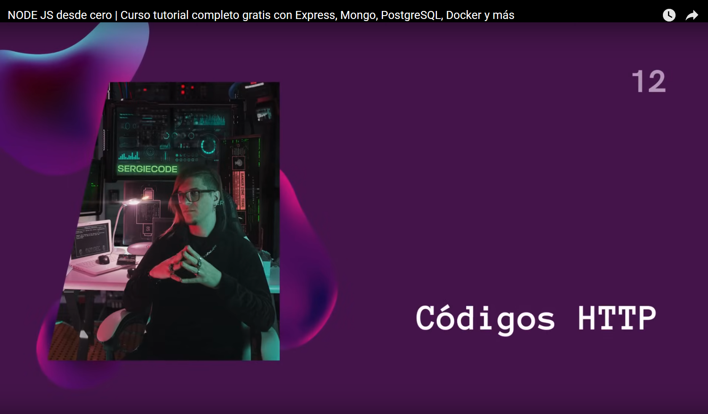
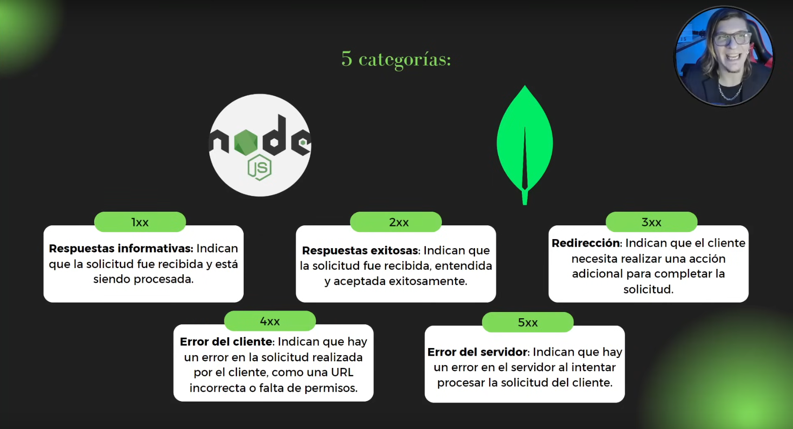
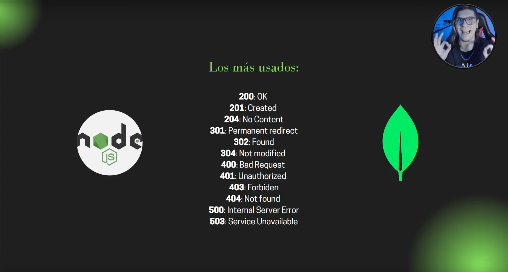

# [01:28:05](https://www.youtube.com/watch?v=I17ln313Pjk&list=TLPQMDEwNjIwMjUxxiOoJ0A2bA&index=1&t=5285s) - **Práctica 1 - [JSON Server](https://www.npmjs.com/package/json-server)**

## [01:36:57](https://www.youtube.com/watch?v=I17ln313Pjk&list=TLPQMDEwNjIwMjUxxiOoJ0A2bA&index=1&t=5817s) - [Postman](https://www.postman.com/downloads/)

### [What are HTTP methods?](https://blog.postman.com/what-are-http-methods/)

## [01:46:30](https://www.youtube.com/watch?v=I17ln313Pjk&list=TLPQMDEwNjIwMjUxxiOoJ0A2bA&index=1&t=6390s) - [Subir Repositorio a Github](https://youtu.be/7ylE8cm3mb0?si=8QcePVeo2AlJH35d)

## [01:51:07](https://www.youtube.com/watch?v=I17ln313Pjk&list=TLPQMDEwNjIwMjUxxiOoJ0A2bA&index=1&t=6667s) - Códigos HTTP

## 🌐 Tabla de Códigos de Estado HTTP

### 1xx - Informativos

| Código | Nombre              | Descripción                                     |
| ------- | ------------------- | ------------------------------------------------ |
| 100     | Continue            | El servidor recibió los encabezados, continuar. |
| 101     | Switching Protocols | Cambio de protocolo solicitado.                  |
| 102     | Processing (WebDAV) | El servidor está procesando la solicitud.       |
| 103     | Early Hints         | Sugerencias tempranas para el cliente.           |

### 2xx - Éxito

| Código | Nombre                 | Descripción                               |
| ------- | ---------------------- | ------------------------------------------ |
| 200     | OK                     | Solicitud exitosa.                         |
| 201     | Created                | Recurso creado exitosamente.               |
| 202     | Accepted               | Aceptada, pero aún no procesada.          |
| 203     | Non-Authoritative Info | Información de otra fuente.               |
| 204     | No Content             | Sin contenido que devolver.                |
| 205     | Reset Content          | Reiniciar vista del formulario.            |
| 206     | Partial Content        | Respuesta parcial (usado con rangos).      |
| 207     | Multi-Status (WebDAV)  | Múltiples estados.                        |
| 208     | Already Reported       | Ya reportado.                              |
| 226     | IM Used                | Respuesta de transformación de contenido. |

### 3xx - Redirección

| Código | Nombre             | Descripción                                   |
| ------- | ------------------ | ---------------------------------------------- |
| 300     | Multiple Choices   | Múltiples opciones disponibles.               |
| 301     | Moved Permanently  | Recurso movido permanentemente.                |
| 302     | Found              | Redirección temporal.                         |
| 303     | See Other          | Ver otro recurso.                              |
| 304     | Not Modified       | No ha cambiado desde la última petición.     |
| 305     | Use Proxy          | Usar proxy específico.                        |
| 307     | Temporary Redirect | Redirección temporal (sin cambiar método).   |
| 308     | Permanent Redirect | Redirección permanente (sin cambiar método). |

### 4xx - Error del cliente

| Código | Nombre                        | Descripción                                   |
| ------- | ----------------------------- | ---------------------------------------------- |
| 400     | Bad Request                   | Solicitud malformada.                          |
| 401     | Unauthorized                  | No autorizado (requiere autenticación).       |
| 402     | Payment Required              | Requiere pago (experimental).                  |
| 403     | Forbidden                     | Acceso denegado.                               |
| 404     | Not Found                     | Recurso no encontrado.                         |
| 405     | Method Not Allowed            | Método HTTP no permitido.                     |
| 406     | Not Acceptable                | No se puede entregar en el formato solicitado. |
| 407     | Proxy Authentication          | Requiere autenticación con proxy.             |
| 408     | Request Timeout               | Tiempo de espera agotado.                      |
| 409     | Conflict                      | Conflicto con el estado actual del recurso.    |
| 410     | Gone                          | El recurso ya no está disponible.             |
| 411     | Length Required               | Se requiere encabezado `Content-Length`.     |
| 412     | Precondition Failed           | Falla en las precondiciones.                   |
| 413     | Payload Too Large             | Cuerpo de solicitud muy grande.                |
| 414     | URI Too Long                  | URI demasiado larga.                           |
| 415     | Unsupported Media Type        | Tipo de medio no soportado.                    |
| 416     | Range Not Satisfiable         | Rango no disponible.                           |
| 417     | Expectation Failed            | El encabezado `Expect` no pudo cumplirse.    |
| 418     | I'm a teapot ☕️             | Broma de April Fools (RFC 2324).               |
| 421     | Misdirected Request           | Solicitud mal dirigida.                        |
| 422     | Unprocessable Entity          | Entidad no procesable.                         |
| 423     | Locked                        | Recurso bloqueado.                             |
| 424     | Failed Dependency             | Falló dependencia.                            |
| 425     | Too Early                     | Demasiado temprano.                            |
| 426     | Upgrade Required              | Requiere actualización de protocolo.          |
| 428     | Precondition Required         | Se requiere precondición.                     |
| 429     | Too Many Requests             | Demasiadas solicitudes.                        |
| 431     | Header Fields Too Large       | Encabezados muy grandes.                       |
| 451     | Unavailable For Legal Reasons | Restringido legalmente.                        |

### 5xx - Error del servidor

| Código | Nombre                          | Descripción                                      |
| ------- | ------------------------------- | ------------------------------------------------- |
| 500     | Internal Server Error           | Error interno del servidor.                       |
| 501     | Not Implemented                 | Funcionalidad no implementada.                    |
| 502     | Bad Gateway                     | Gateway o proxy recibió una respuesta inválida. |
| 503     | Service Unavailable             | Servicio no disponible temporalmente.             |
| 504     | Gateway Timeout                 | Tiempo de espera agotado en el gateway.           |
| 505     | HTTP Version Not Supported      | Versión HTTP no soportada.                       |
| 506     | Variant Also Negotiates         | Variante negocia contenido, pero falla.           |
| 507     | Insufficient Storage            | Almacenamiento insuficiente (WebDAV).             |
| 508     | Loop Detected                   | Bucle detectado (WebDAV).                         |
| 510     | Not Extended                    | Extensiones requeridas no están presentes.       |
| 511     | Network Authentication Required | Requiere autenticación de red.                   |
