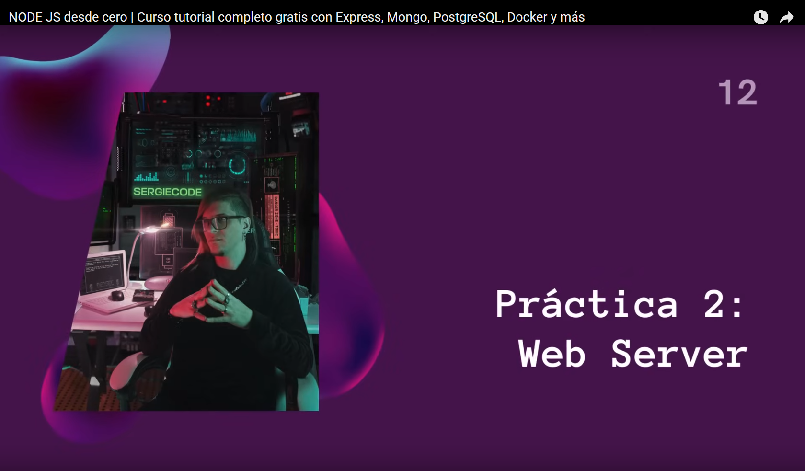

# [01:55:14](https://www.youtube.com/watch?v=I17ln313Pjk&t=6914s) - Práctica 2 - Web Server

## [02:09:20](https://www.youtube.com/watch?v=I17ln313Pjk&t=7760s) - ExpressJS

## [02:28:02](https://www.youtube.com/watch?v=I17ln313Pjk&t=8882s) - Migrar Web Server a ES6

## [02:24:47](https://www.youtube.com/watch?v=I17ln313Pjk&t=8687s) - Editar README.md con stackedit
