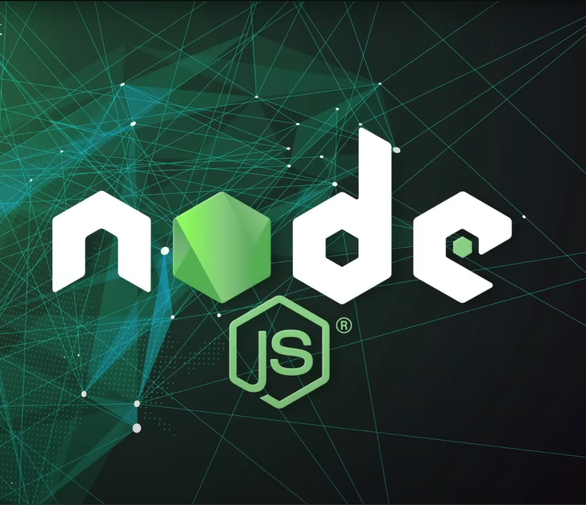

# NODEJS DESDE CERO CON SERGIECODE

## NodeJS dece Cero - Curso Tutorial Completo con 4 Proyectos

## (NodeJS, MongoDB, ExpressJS, PostgreSQL, Docker y más)

###### URL del video en Youtube: https://youtu.be/I17ln313Pjk?si=-BwBZGq7jTOZnnP7

**🔶 **Secciones del curso**
**[00:00:00](https://www.youtube.com/watch?v=I17ln313Pjk&list=TLPQMDEwNjIwMjUxxiOoJ0A2bA&index=1) Introducción cinemática
[00:00:19](https://www.youtube.com/watch?v=I17ln313Pjk&list=TLPQMDEwNjIwMjUxxiOoJ0A2bA&index=1&t=19s) Saludo Inicial
[00:00:19](https://www.youtube.com/watch?v=I17ln313Pjk&list=TLPQMDEwNjIwMjUxxiOoJ0A2bA&index=1&t=19s) Bienvenida
[00:01:42](https://www.youtube.com/watch?v=I17ln313Pjk&list=TLPQMDEwNjIwMjUxxiOoJ0A2bA&index=1&t=102s) Instalaciones necesarias
[00:20:23](https://www.youtube.com/watch?v=I17ln313Pjk&list=TLPQMDEwNjIwMjUxxiOoJ0A2bA&index=1&t=1223s) ¿Qué es Node.js?
[00:26:51](https://www.youtube.com/watch?v=I17ln313Pjk&list=TLPQMDEwNjIwMjUxxiOoJ0A2bA&index=1&t=1611s) Consola de Node.js
[00:34:18](https://www.youtube.com/watch?v=I17ln313Pjk&list=TLPQMDEwNjIwMjUxxiOoJ0A2bA&index=1&t=2058s) Ejecutando archivos JavaScript
[00:37:56](https://www.youtube.com/watch?v=I17ln313Pjk&list=TLPQMDEwNjIwMjUxxiOoJ0A2bA&index=1&t=2276s) File System (Manipular archivos)
[00:45:25](https://www.youtube.com/watch?v=I17ln313Pjk&list=TLPQMDEwNjIwMjUxxiOoJ0A2bA&index=1&t=2725s) npm init & package.json
[00:55:07](https://www.youtube.com/watch?v=I17ln313Pjk&list=TLPQMDEwNjIwMjUxxiOoJ0A2bA&index=1&t=3307s) nodemon
[01:00:37](https://www.youtube.com/watch?v=I17ln313Pjk&list=TLPQMDEwNjIwMjUxxiOoJ0A2bA&index=1&t=3637s) importanciones y exportaciones
[01:09:13](https://www.youtube.com/watch?v=I17ln313Pjk&list=TLPQMDEwNjIwMjUxxiOoJ0A2bA&index=1&t=4153s) variables de entorno
[01:21:25](https://www.youtube.com/watch?v=I17ln313Pjk&list=TLPQMDEwNjIwMjUxxiOoJ0A2bA&index=1&t=4885s) Herramientas para las prácticas

沐ｷ **PRﾃ，TICA 1**
[01:28:05](https://www.youtube.com/watch?v=I17ln313Pjk&list=TLPQMDEwNjIwMjUxxiOoJ0A2bA&index=1&t=5285s) PRACTICA 1: json-server
[01:36:57](https://www.youtube.com/watch?v=I17ln313Pjk&list=TLPQMDEwNjIwMjUxxiOoJ0A2bA&index=1&t=5817s) Postman
[01:46:30](https://www.youtube.com/watch?v=I17ln313Pjk&list=TLPQMDEwNjIwMjUxxiOoJ0A2bA&index=1&t=6390s) Subir Repositorio a Github
[01:51:07](https://www.youtube.com/watch?v=I17ln313Pjk&list=TLPQMDEwNjIwMjUxxiOoJ0A2bA&index=1&t=6667s) Códigos HTTP

沐ｷ **PRﾃ，TICA 2**
[01:55:14](https://www.youtube.com/watch?v=I17ln313Pjk&list=TLPQMDEwNjIwMjUxxiOoJ0A2bA&index=1&t=6914s) PRACTICA 2: Web Server
[02:09:20](https://www.youtube.com/watch?v=I17ln313Pjk&list=TLPQMDEwNjIwMjUxxiOoJ0A2bA&index=1&t=7760s) Express js
[02:28:02](https://www.youtube.com/watch?v=I17ln313Pjk&list=TLPQMDEwNjIwMjUxxiOoJ0A2bA&index=1&t=8882s) Migrar Web Server a ES6
[02:24:47](https://www.youtube.com/watch?v=I17ln313Pjk&list=TLPQMDEwNjIwMjUxxiOoJ0A2bA&index=1&t=8687s) Editar README.md con stackedit

沐ｷ **PRﾃ，TICA 3**
[02:34:59](https://www.youtube.com/watch?v=I17ln313Pjk&list=TLPQMDEwNjIwMjUxxiOoJ0A2bA&index=1&t=9299s) PRACTICA 3: API REST (CRUD) con Mongo
[02:42:02](https://www.youtube.com/watch?v=I17ln313Pjk&list=TLPQMDEwNjIwMjUxxiOoJ0A2bA&index=1&t=9722s) Mongoose
[02:53:42](https://www.youtube.com/watch?v=I17ln313Pjk&list=TLPQMDEwNjIwMjUxxiOoJ0A2bA&index=1&t=10422s) Middleware propio
[02:59:20](https://www.youtube.com/watch?v=I17ln313Pjk&list=TLPQMDEwNjIwMjUxxiOoJ0A2bA&index=1&t=10760s) Body Parser
[03:04:25](https://www.youtube.com/watch?v=I17ln313Pjk&list=TLPQMDEwNjIwMjUxxiOoJ0A2bA&index=1&t=11065s) MongoDB
[03:08:35](https://www.youtube.com/watch?v=I17ln313Pjk&list=TLPQMDEwNjIwMjUxxiOoJ0A2bA&index=1&t=11315s) Docker
[03:10:15](https://www.youtube.com/watch?v=I17ln313Pjk&list=TLPQMDEwNjIwMjUxxiOoJ0A2bA&index=1&t=11415s) Mongo Compass
[03:12:32](https://www.youtube.com/watch?v=I17ln313Pjk&list=TLPQMDEwNjIwMjUxxiOoJ0A2bA&index=1&t=11552s) Probando la API REST
[03:34:53](https://www.youtube.com/watch?v=I17ln313Pjk&list=TLPQMDEwNjIwMjUxxiOoJ0A2bA&index=1&t=12893s) Despliegue de backend y base de datos en Railway

沐ｷ **PRﾃ，TICA 4**
[03:45:00](https://www.youtube.com/watch?v=I17ln313Pjk&list=TLPQMDEwNjIwMjUxxiOoJ0A2bA&index=1&t=13500s) PRACTICA 4: API REST(CRUD) con PostgreSQL
[03:49:18](https://www.youtube.com/watch?v=I17ln313Pjk&list=TLPQMDEwNjIwMjUxxiOoJ0A2bA&index=1&t=13758s) Node.js con TypeScript
[04:06:27](https://www.youtube.com/watch?v=I17ln313Pjk&list=TLPQMDEwNjIwMjUxxiOoJ0A2bA&index=1&t=14787s) Prisma
[04:12:13](https://www.youtube.com/watch?v=I17ln313Pjk&list=TLPQMDEwNjIwMjUxxiOoJ0A2bA&index=1&t=15133s) Bcrypt (encriptar contraseñas)
[04:16:57](https://www.youtube.com/watch?v=I17ln313Pjk&list=TLPQMDEwNjIwMjUxxiOoJ0A2bA&index=1&t=15417s) JWT (autenticación token)
[04:23:10](https://www.youtube.com/watch?v=I17ln313Pjk&list=TLPQMDEwNjIwMjUxxiOoJ0A2bA&index=1&t=15790s) PostgreSQL
[04:34:51](https://www.youtube.com/watch?v=I17ln313Pjk&list=TLPQMDEwNjIwMjUxxiOoJ0A2bA&index=1&t=16491s) TablePlus
[04:37:28](https://www.youtube.com/watch?v=I17ln313Pjk&list=TLPQMDEwNjIwMjUxxiOoJ0A2bA&index=1&t=16648s) Manejo de errores
[05:15:09](https://www.youtube.com/watch?v=I17ln313Pjk&list=TLPQMDEwNjIwMjUxxiOoJ0A2bA&index=1&t=18909s) Probando la API
[05:23:25](https://www.youtube.com/watch?v=I17ln313Pjk&list=TLPQMDEwNjIwMjUxxiOoJ0A2bA&index=1&t=19405s) Scripts despliegue y build
[05:26:24](https://www.youtube.com/watch?v=I17ln313Pjk&list=TLPQMDEwNjIwMjUxxiOoJ0A2bA&index=1&t=19584s) Subir repositorio externo
[05:28:22](https://www.youtube.com/watch?v=I17ln313Pjk&list=TLPQMDEwNjIwMjUxxiOoJ0A2bA&index=1&t=19702s) Despliegue
[05:38:30](https://www.youtube.com/watch?v=I17ln313Pjk&list=TLPQMDEwNjIwMjUxxiOoJ0A2bA&index=1&t=20310s) Despedida
